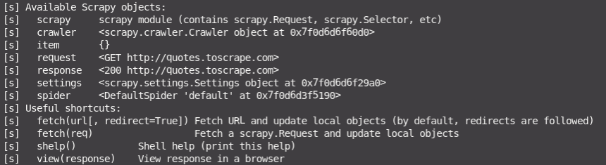

# Scrapy tutorial

Learning scrapy framework

## Scrapy commands

- `scrapy startproject <project_name>` - Create a scrapy project

- `scrapy crawl <spider_name> -o output.json` - Run a specific spider and save the output to a JSON

- `scrapy shell <url>` - This starts a scrapy python shell with the response, so that we can play around with the response. Makes authoring a spider easier.

- XPath or CSS selector can be used.

## Tutorials

- [A Minimalist End-to-End Scrapy Tutorial - 5 part series](https://towardsdatascience.com/a-minimalist-end-to-end-scrapy-tutorial-part-i-11e350bcdec0). This tutorial uses [quotes.toscrape.com](http://quotes.toscrape.com/)
